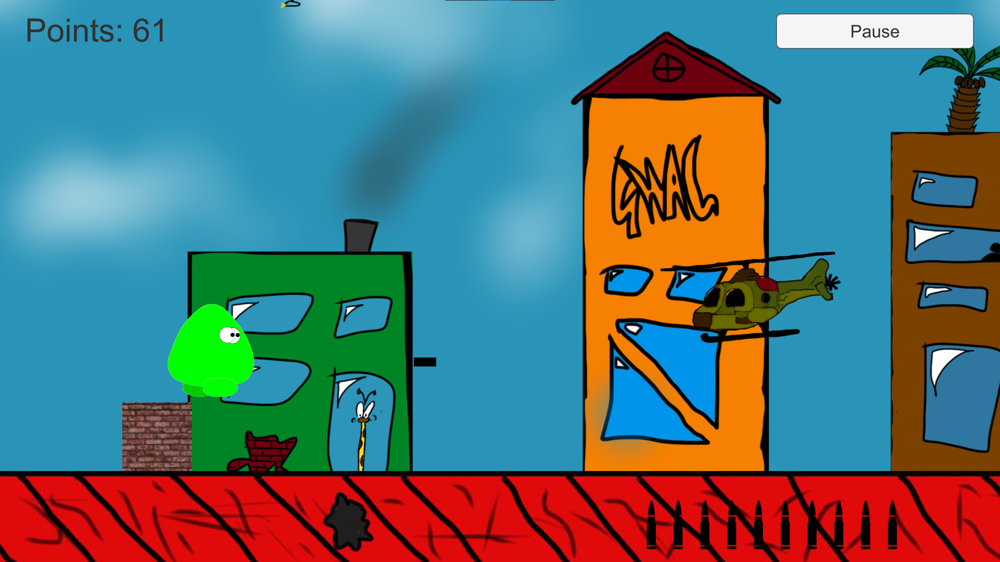
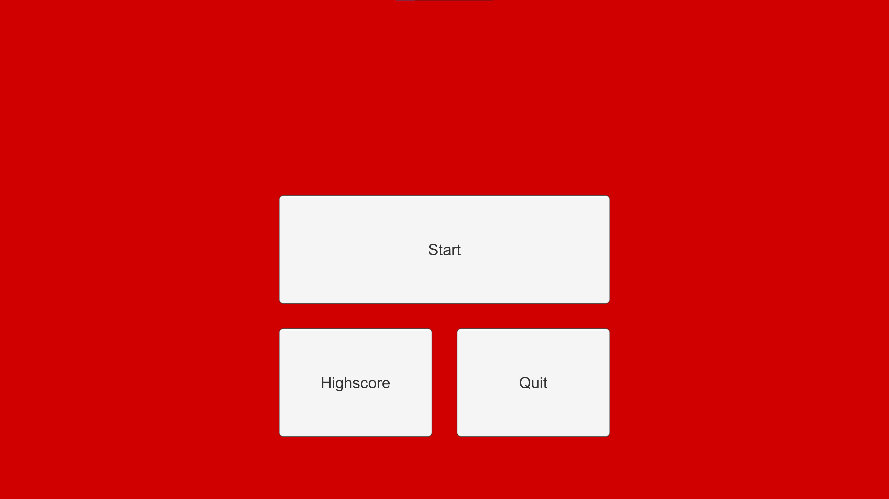

# Rooftop-Runner

## About the Project
Rooftop Runner is a 2D jump-and-run game where you navigate across the rooftops of buildings. Your goal is to avoid obstacles, battle enemies, and achieve the highest possible score. 

Originally created in 2016 and revised in 2025.

### Built With
This project was built using Unity 6 and C#.

## Installation

### Windows
1. Download and extract the Windows version.
2. Run `Rooftop Runner.exe`.

### Mac
1. Download and extract the Mac version.
2. Run `Rooftop Runner.app`.

### Linux
1. Download and extract the Linux version.
2. Run `Rooftop Runner.x86_64`.

### Android
1. Download and extract the Android version.
2. Install and run `Rooftop Runner.apk`.

## How to Play
You automatically run along a rooftop, aiming to progress as far as possible. To succeed, avoid obstacles, defeat enemies, and manage your ammunition. 

### Controls
- **Jump:** <kbd>W</kbd> / Swipe Up
- **Duck:** <kbd>S</kbd> / Swipe Down
- **Shoot:** <kbd>Space</kbd> / Tap Screen

### Obstacles and Enemies
- **Boxes:** Jump over or shoot them to clear your path.
- **Bricks:** These are indestructible. Use a double jump or a duck for high bricks and a regular jump for low bricks.
- **Monsters:** Avoid them, jump on their heads to defeat them, or shoot them.
- **Helicopters:** These shoot at you from a distance. Dodge their shots or defeat them by shooting back. If avoided, they will eventually run out of ammunition and leave.

### Power-Ups
- **Star:** Grants temporary invincibility and increased speed, allowing you to pass through obstacles and enemies. Beware when the effect ends.
- **Gun:** Replenishes your ammunition.

Enjoy the game and strive for a new high score!

## Development
To contribute or make modifications, follow these steps:

1. Install Unity 6.
2. Open the project in Unity.

### Scenes
- **MainMenu:** Initial screen displayed at startup.
- **Highscore:** Displays the current high score.
- **Main:** The core gameplay scene.

### Key GameObjects
- **Player:**
  - Contains the player model and animations.
  - Scripts:
    - `PlayerMovement`: Handles jumping and ducking.
    - `PlayerShooting`: Manages shooting, including bullet creation and ammunition tracking.
    - `SwipeInputController`: Detects swipes for mobile controls.

- **Background and Floor:**
  - Use the `ObjectSwap` script to recycle and reposition elements for endless running.

- **GameController:**
  - Manages game logic and consists of:
    - `GameController`: Handles main logic.
    - `SpeedController`: Increases game speed as the player progresses.
    - `ScoreController`: Tracks the score.
    - `ButtonController`: Responds to button presses.

## License
Distributed under the GPL-3.0 license. See the `LICENSE` file for details.
